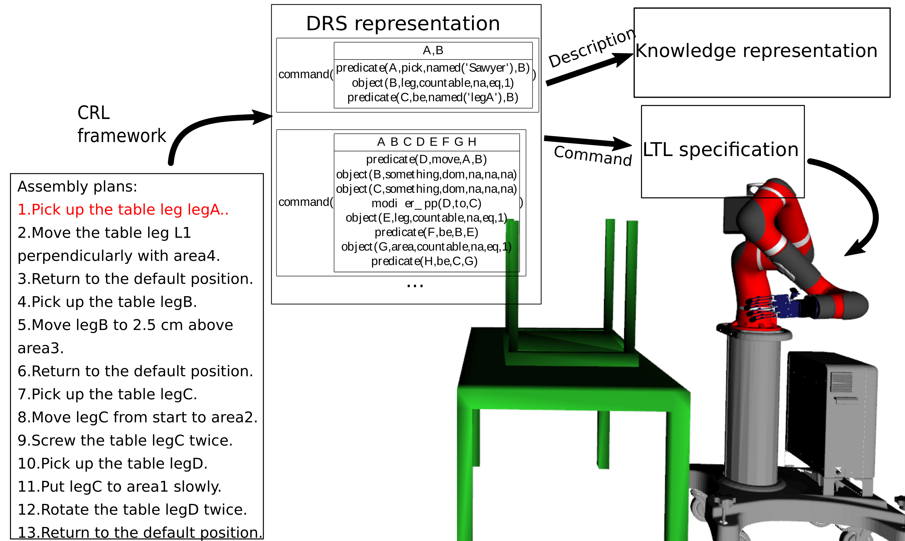

# CRL: Controlled Robot Language

This reporsitory contains grammar for Natural Language Interface (an extension of Controlled Natural Language, but specified for robotic applications) and its vocabulary.

To understand more about the framework, please read our work in `papers` (Updating).

## General Framework:

<image src="images/Framework.png" width="400">

<!--  -->

## CRL Framework details:

<image src="images/CRL_Framework.png" width="400">
<!--  -->

## Application and Usage

Reliable communication between humans and intelligent robots is a critical need especially for human-robot collaboration, human-agent teaming, and multiple agent coordination. For most robotic applications, reliable human-robot communication will significantly reduce the chances of unpredictable catastrophes and fatal damages. In addition to physical interaction, natural language has the potential to become the main communication channel for instructing robots, representing contextual knowledge, and providing feedback. From a psychological perspective, trust is the grant obstacle preventing human and robot communicate effectively. A robot with dynamic consciousness and optimized precision does not necessarily gain trust from its users. We believe that the lack of reliable natural-language communication is one of the main factors that hinder the advancement of human-agent teaming.
